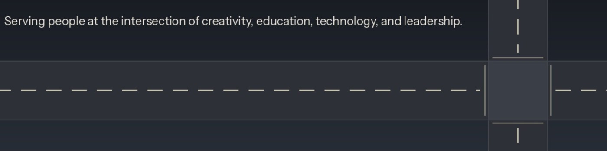

# Hi, I'm Jon Riggert 👋

**Senior Technical Program Manager (PMP, ITIL) | IT Service Delivery Leader** 
*Enterprise Operations Modernization • Agile Delivery • AI Enablement Governance*

📍 Nixa, Missouri (SWMO) / Remote • [LinkedIn](https://linkedin.com/in/jonriggert) • [Website](https://jonriggert.com)

---

### 🏛️ About Me

I am an enterprise technical leader and certified **PMP** & **ITIL** practitioner with 15+ years of experience transforming chaotic technical infrastructure into high-throughput, predictable operational delivery.

* 🚀 **Technical Program & Portfolio Delivery:** Governing multi-site IT delivery pipelines, Agile/Hybrid Kanban frameworks, and executive steering.
* 🛠️ **IT Service Management (ITSM):** Designing centralized intake, Tier-3 escalation architectures (Jira Service Management), and Change Advisory Board (CAB) governance.
* 🤖 **Enterprise AI Enablement:** Architecting practical agentic workflows, Atlassian Rovo automations, and Model Context Protocol (MCP) integrations to eliminate corporate toil.
* 🛡️ **Zero-Downtime Infrastructure:** Background spanning $1B museum systems commissioning across 12 venues, 2,000-seat live theatre automation, and enterprise Microsoft 365 / Azure cloud migrations.

---

### 🎯 Credentials & Certifications

* **PMP®** — Project Management Professional (PMI, April 2026)
* **ITIL® 4 Foundation** — PeopleCert (August 2026)
* **Atlassian Certified Professional** — Managing Jira Service Projects (ACP-420) & Board Configuration (ACA-905)
* **Microsoft Certified** — Azure Fundamentals (AZ-900) & Microsoft 365 Fundamentals (MS-900)
* **CompTIA** — Network+ Certified | **Google** — IT Support Professional Certificate

---

### 🧰 Technical & Governance Ecosystem

* **Program & Process:** Jira Software, Jira Service Management, Confluence, Hybrid Kanban, RACI Decision Frameworks, SLA Design.
* **Cloud & Systems:** Microsoft 365, Azure, Entra ID (RBAC / MFA / Conditional Access), Microsoft Intune, Cisco Meraki, Windows Server, VMware.
* **AI & Agentic Architectures:** Atlassian Rovo, Model Context Protocol (MCP), Prompt Engineering, Python, Markdown Scaffolding.

---

### 💬 Connect With Me

* 💼 **LinkedIn:** [linkedin.com/in/jonriggert](https://linkedin.com/in/jonriggert)
* 🌐 **Website:** [jonriggert.com](https://jonriggert.com)

<!--
**jonriggert/jonriggert** is a ✨ _special_ ✨ repository because its `README.md` (this file) appears on your GitHub profile.

Here are some ideas to get you started:

- 🔭 I’m currently working on ...
- 🌱 I’m currently learning ...
- 👯 I’m looking to collaborate on ...
- 🤔 I’m looking for help with ...
- 💬 Ask me about ...
- 📫 How to reach me: ...
- 😄 Pronouns: ...
- ⚡ Fun fact: ...
-->

<!--
**jonriggert/jonriggert** is a ✨ _special_ ✨ repository because its `README.md` (this file) appears on your GitHub profile.

Here are some ideas to get you started:

- 🔭 I’m currently working on ...
- 🌱 I’m currently learning ...
- 👯 I’m looking to collaborate on ...
- 🤔 I’m looking for help with ...
- 💬 Ask me about ...
- 📫 How to reach me: ...
- 😄 Pronouns: ...
- ⚡ Fun fact: ...
-->
