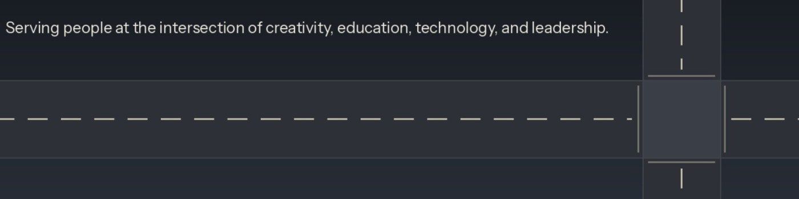

# Hi, I'm Jon Riggert 👋

**Senior Technical Program Manager | Customer Education & AI Enablement | PMP & ITIL 4**

I am a "Teacher-Builder" operating at the intersection of Enterprise IT Operations, Agile Delivery, and Agentic AI Architecture. My professional focus is translating complex technical capabilities into business value, and building the training ecosystems that drive enterprise adoption.
Currently, I lead enterprise IT operations for a 1,000+ user organization, where I'm actively deploying Atlassian Rovo AI agents and automated governance workflows to eliminate organizational toil.

---

### 🚀 What I'm Building in the Open

I use GitHub to open-source my personal infrastructure and AI experiments. 

**The LifeOS (Personal AI Infrastructure)**
I have architected a highly customized, model-agnostic local AI environment that acts as a persistent Chief of Staff and Board of Advisors. 

**Master Council Orchestrator**
A python orchestration script that pulls local markdown state, feeds it to 7 concurrent AI archetypes (using local CLI wrappers) for parallel evaluation, runs a Devil's Advocate critique loop, and outputs an executive synthesis.

**Agentic Workflows** 
Custom implementations of Model Context Protocol (MCP) boundaries and bash automation.

### 🛠️ Tech Stack & Tooling
**Methodology:** Lean-Agile, Hybrid Kanban, ITIL 4 Service Design
**Orchestration:** Atlassian Suite (Jira, Confluence, Rovo AI), GitHub
**AI Ecosystem:** Gemini, Claude, GPT, OpenClaw architecture concepts
**Scripting:** Python, Bash, Markdown (Obsidian)

### 📫 Let's Connect
* **LinkedIn:** [linkedin.com/in/jonriggert](https://linkedin.com/in/jonriggert)
* **Location:** Nixa, MO (Remote/Central Time)
<!--
**jonriggert/jonriggert** is a ✨ _special_ ✨ repository because its `README.md` (this file) appears on your GitHub profile.

Here are some ideas to get you started:

- 🔭 I’m currently working on ...
- 🌱 I’m currently learning ...
- 👯 I’m looking to collaborate on ...
- 🤔 I’m looking for help with ...
- 💬 Ask me about ...
- 📫 How to reach me: ...
- 😄 Pronouns: ...
- ⚡ Fun fact: ...
-->

<!--
**jonriggert/jonriggert** is a ✨ _special_ ✨ repository because its `README.md` (this file) appears on your GitHub profile.

Here are some ideas to get you started:

- 🔭 I’m currently working on ...
- 🌱 I’m currently learning ...
- 👯 I’m looking to collaborate on ...
- 🤔 I’m looking for help with ...
- 💬 Ask me about ...
- 📫 How to reach me: ...
- 😄 Pronouns: ...
- ⚡ Fun fact: ...
-->
